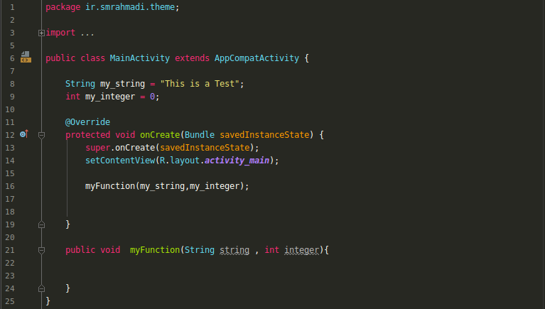
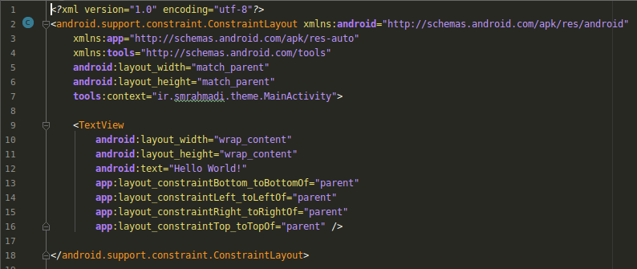

# Dark-Rainbow-Theme
Theme For jetbrains base ides (Android Studio 1.5+ , IntelliJ IDEA , PhpStorm , PyCharm , AppCode and etc . ) 
 
 

## ScreenShot : ##

### java : ###

### xml : ###

# Installation
1. Download the DarkRainbow.jar or clone this repository.

2. In Android Studio choose File > Import Settings ...

